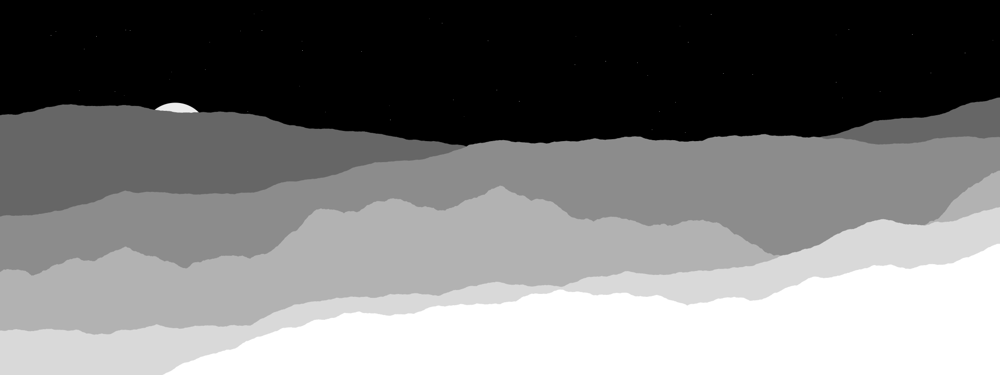
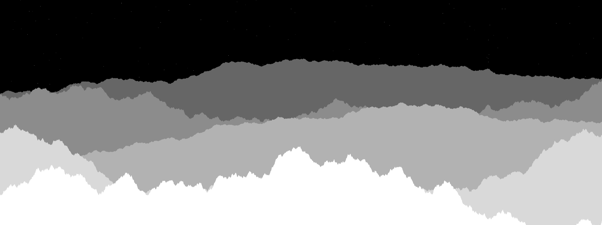
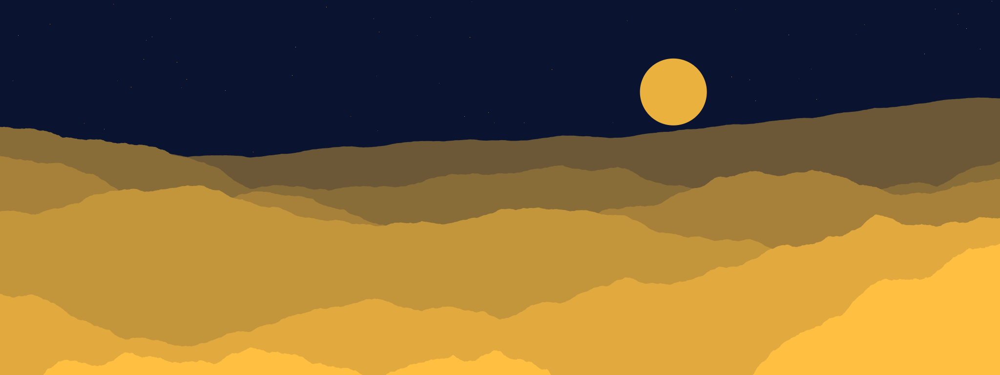
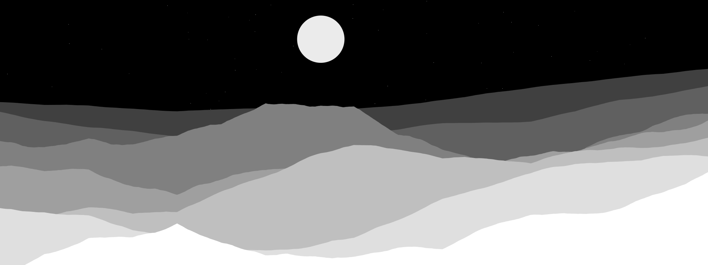
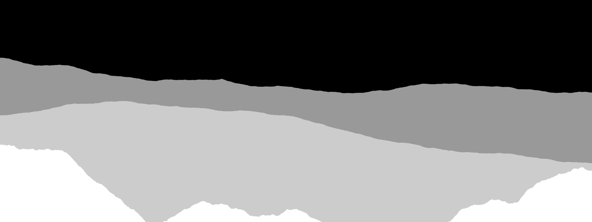
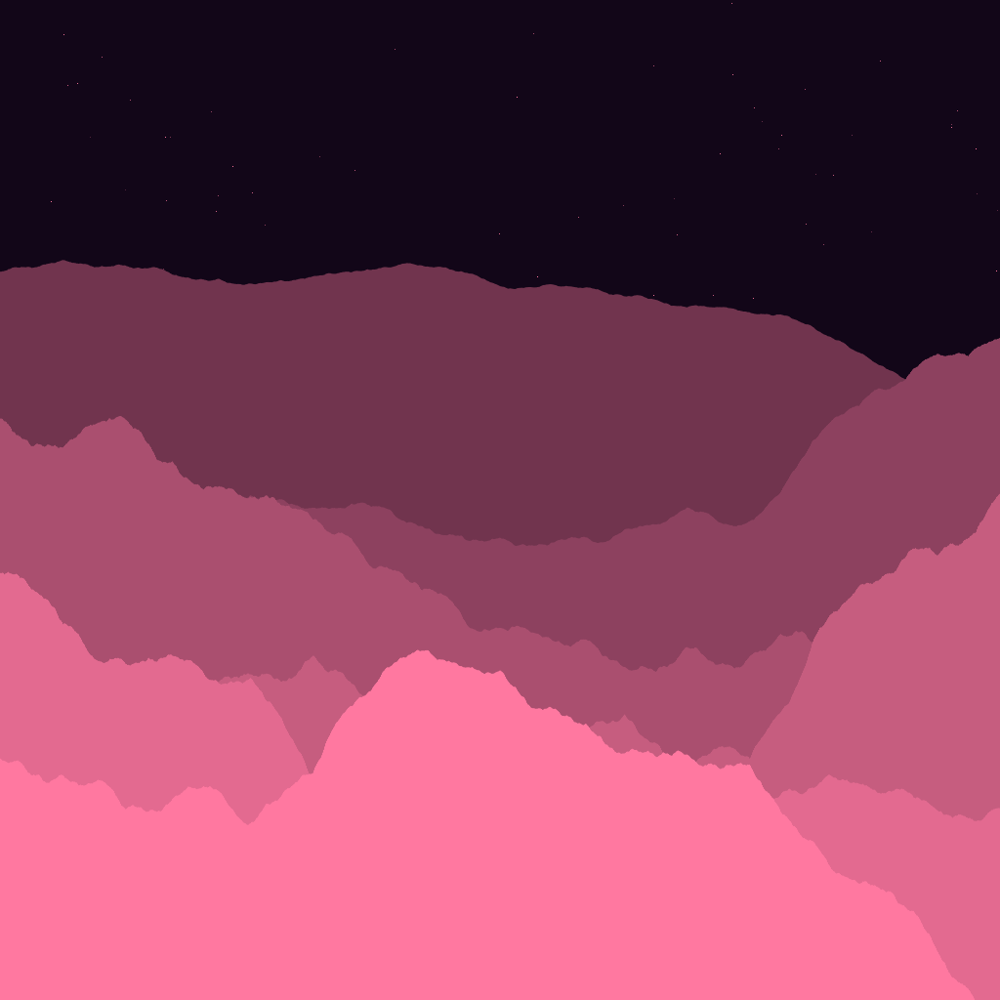

# procmount

Procedurally generate mountain landscape images. Zero dependencies — pure Python
standard library, including a built-in PNG writer.

Layered fractal ridgelines (1-D midpoint displacement) stacked back-to-front, with
atmospheric depth fade, a moon, and a starfield.



## Usage

```sh
python3 -m procmount                       # 2048x768, white landscape on black
python3 -m procmount -o out.png --seed 7   # reproducible
python3 -m procmount --bg midnight --fg cream --layers 6
python3 -m procmount --roughness 1.3 --no-moon --stars 0
```

Installable too (`pip install -e .`), which provides a `procmount` command.

## Options

| Flag | Default | Description |
|------|---------|-------------|
| `-o, --output` | `mountain.png` | output PNG path |
| `-W, --width` | `2048` | image width (px) |
| `-H, --height` | `768` | image height (px) |
| `-l, --layers` | `5` | number of mountain ranges |
| `-r, --roughness` | `1.0` | ridge jaggedness; higher is rougher (~0.4–1.4) |
| `-s, --seed` | random | random seed for reproducible output |
| `--fade` | `0.6` | atmospheric fade of distant ranges into the background (0–1) |
| `--moon / --no-moon` | on | draw a moon |
| `--moon-size` | auto | moon radius in px |
| `--stars` | `120` | number of stars |
| `--fg` | `white` | landscape color |
| `--bg` | `black` | background color |

Colors accept a name (`white`, `midnight`, `cream`, …), hex (`#rrggbb`, `#rgb`),
or an `r,g,b` triplet.

## Gallery

Every image lives in [`demo/`](demo/) and is reproducible from its command.

**Midnight** — `--bg midnight --fg cream --layers 6`


**Jagged peaks** — `--roughness 1.3 --no-moon --stars 220`


**Dusk** — `--bg navy --fg amber --layers 6`


**Rolling hills** — `--roughness 0.6 --layers 7 --fade 0.75`


**Minimal** — `--layers 3 --no-moon --stars 0 --fade 0.4`


**Cyan night** — `--bg "#02060f" --fg cyan --layers 6 --stars 300`


**Square rose** — `-W 1024 -H 1024 --bg "#120618" --fg pink --layers 6`



Regenerate them all:

```sh
python3 -m procmount --seed 7  -o demo/01-classic.png
python3 -m procmount --seed 3  --bg midnight --fg cream --layers 6        -o demo/02-midnight.png
python3 -m procmount --seed 11 --roughness 1.3 --no-moon --stars 220      -o demo/03-jagged-peaks.png
python3 -m procmount --seed 21 --bg navy --fg amber --layers 6            -o demo/04-dusk.png
python3 -m procmount --seed 5  --roughness 0.6 --layers 7 --fade 0.75     -o demo/05-rolling-hills.png
python3 -m procmount --seed 42 --layers 3 --no-moon --stars 0 --fade 0.4  -o demo/06-minimal.png
python3 -m procmount --seed 19 --bg "#02060f" --fg cyan --layers 6 --stars 300 -o demo/07-cyan-night.png
python3 -m procmount --seed 8  -W 1024 -H 1024 --bg "#120618" --fg pink --layers 6 -o demo/08-square-rose.png
```

## Library

```python
from procmount import generate
from procmount.png import write_png

c = generate(width=1600, height=600, seed=1, layers=6)
write_png("out.png", c.w, c.h, c.buf)
```

## Tests

```sh
python3 -m unittest discover -s tests
```
